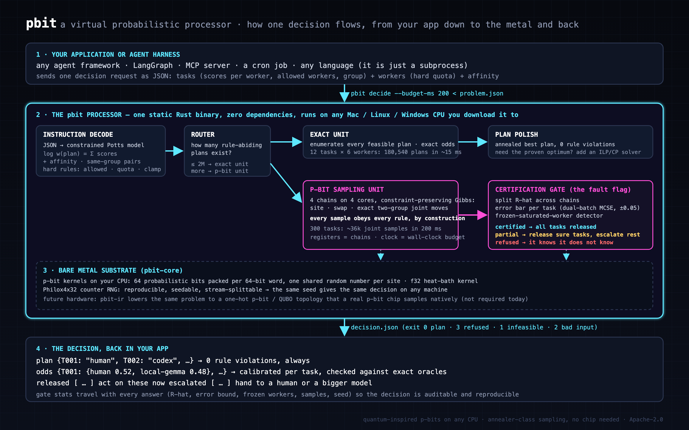

# pbit: a virtual probabilistic processor for joint decisions under hard rules

[](https://github.com/BitmapAsset/pbit/actions/workflows/ci.yml)
[](LICENSE)


`pbit` is a **software processor built from p-bits**: bits that are 1 with a probability you set, coupled so that they
sample whole configurations together. You give it a *program* (variables, their allowed values, scores, pairwise
couplings, hard caps) and it returns three things:

1. an answer that **obeys every hard rule by construction** (the sampler never leaves the feasible set; if it cannot find
   a feasible start within the budget it returns `refused` and no plan);
2. **odds for every variable**, exact when the program is small or thin enough, otherwise sampled with an error bound;
3. a **verdict**: `exact` (proof-grade under the score model), `diagnostics_passed` (sampled: every released item passed
   the versioned diagnostics gate; not a proof), `partial` (act on the released variables, escalate the rest), `refused` or
   `infeasible` (a proof).

The first front-end is a task router. Give it a queue of things to assign (tasks to workers, tickets to agents, jobs to
machines), the score of every option, the rules that must hold (allowed sets, capacities, forced choices) and how much
items that belong together should stay together. It samples **whole plans** on a p-bit substrate, so every plan it returns
obeys every rule, and it returns **odds per item** (exact, or Monte-Carlo estimates of the marginals of the score model you
supplied: accuracy under that model, not predictive calibration) with a **diagnostics gate** that releases the items whose
diagnostics pass and escalates the rest. The gate can be fooled: when every chain misses the same mode it releases wrong
odds with a tiny error bar (see [Known failure modes](BENCHMARKS.md#known-failure-modes)).

A p-bit is a bit that is 0 or 1 with a tunable probability; coupled p-bits sample joint configurations. pbit is
quantum-inspired and entirely classical (see "Is this quantum?" below): it runs on the CPU you already have, needs no
network and has zero external crates. The same problem lowers to the QUBO/Ising form a p-bit or annealer chip takes (`pbit-ir`), which is the hardware
hand-off for later.

```
$ cargo run --release -q -p pbit-cli -- demo --tasks 300 | cargo run --release -q -p pbit-cli -- decide --budget-ms 200
{"engine":"pbit 0.2.0","tasks":300,"workers":6,"affinity":1.2,"verdict":"diagnostics_passed","plan":{"T000":"human",…},
 "violations":0,"odds":{"T000":{"human":0.78,"local-gemma":0.22},…},"released":[…300…],"escalated":[],
 "gate":{"rhat":1.00015,"tv_bound":0.023,"tv_tol":0.05,"frozen_saturated_workers":0,…},"ms":291.6}
```

**`diagnostics_passed` has a definition, and it is not a proof.** (It replaces the 0.1.0 verdict `certified`.) The answer
passed gate/3: a 3-sigma batch-means Monte-Carlo bound (at most 0.05 total variation per released item), split R-hat of the
log-weight trace and of every released variable's value indicators, batch-size stability and frozen-resource checks, tuned against exact oracles on small synthetic families.
Every sampled answer reports `gate.version`, `gate.assumptions`, both MCSE estimates, the worst item's per-chain means and a
`release_reason` per item. These checks cannot see a mode that no chain visits: on the frozen stress corpus
(`pbit-cli/tests/stress/`) 2-3 of 20 seeds per family pass with every released item wrong (BENCHMARKS "Known failure
modes"). The tables are in [BENCHMARKS.md](BENCHMARKS.md).

## Install

- **Prebuilt binaries** for Linux x86_64, macOS (Apple silicon and Intel) and Windows x86_64 are attached to every tagged
  release on the [Releases page](https://github.com/BitmapAsset/pbit/releases), each with a `.sha256` beside it. Unpack
  and put `pbit` on your `PATH`.
- **From source** with stable Rust: `cargo install --git https://github.com/BitmapAsset/pbit pbit-cli` installs the `pbit`
  binary; or clone and `cargo build --release -p pbit-cli` (it lands in `target/release/pbit`). Nothing is downloaded after
  the clone: there are no external crates.

## 60-second tour

```
git clone https://github.com/BitmapAsset/pbit && cd pbit
cargo test --release --workspace                                   # 127 tests (3 core, 48 CLI, 11 stress, 18 acceptance, 47 pbit-ir; 1 ignored), ~25 s once built
cargo run --release -p pbit-cli -- demo --tasks 12 | cargo run --release -p pbit-cli -- decide --pretty
cargo run --release --example agent_router                         # the full narrated demo, ~3 s
```

The demo problem is an AI-agent task router: a queue of tasks and a set of workers (`opus`, `sonnet`, `luna-pro`,
`local-gemma`, `codex`, `human`) under hard policy (PII only on-prem or with a human; production-DB migrations never on
cheap models), per-hour quotas, and a bonus for keeping one customer's workflow on one worker. A rule-ignoring per-task argmax over
the demo's synthetic scores (a strawman baseline) produces **144 violations and 60 PII leaks** on 300 tasks. `pbit` produces **0 violations**,
per-task odds that match exact enumeration wherever exact enumeration is possible, and escalates the tasks whose odds it
cannot pin down in the time budget.

To watch it refuse when its diagnostics fail, make the queue hard (96 % full, strong affinity):
```
$ pbit demo --tasks 300 --hard | pbit decide --budget-ms 50     # "refused": 0 released, exit 3
$ pbit demo --tasks 300 --hard | pbit decide --budget-ms 200    # "partial": 87-95 of 300 released, the rest escalated
$ pbit demo --tasks 300 --hard | pbit decide --budget-ms 1000   # "diagnostics_passed": 300 released, 0 violations
```
(5 runs each on an Apple M4.) Every escalated task's odds are in the output; the decision is left to you. The budget is
wall-clock, so a slower machine needs a longer one; `--sweeps N --polish-sweeps M` gives the same output on every machine.

Everything runs with stock stable Rust and **no external crates**, so `cargo build` needs no network (a fresh export builds
`cargo build --release` in 7.82 s and every target in 26-28 s on the M4).

## Inside the processor



### The substrate (`pbit-core`)
A Philox4x32-10 counter RNG (reproducible, stream-splittable: the same seed gives the same decision on any machine) and two
p-bit kernels: a bit-sliced multispin kernel (64 replicas per `u64`, one shared uniform per site, plus a
parallel-tempering-in-a-word prefix-mask variant) and an SoA `f32` heat-bath.

| what runs | updates/s on the M4 (BENCHMARKS §1) |
|---|---|
| structured multispin kernel, 64 replicas bit-sliced per word, 4 threads | 1.48e11 replica-site updates/s |
| heat-bath kernel, one lattice, 1 thread | 9.13e8 |
| a general `pbit-ir` program, 1 / 4 threads | 2.28e7 / 7.68e7 |

The first line counts 64 packed replicas per word (they share one random draw per site, so they are not independent); one problem does not run 64x faster. The first two rows are
standalone lattice kernels (`pbit-core/examples/kernels`): `pbit decide` and `pbit run` use only pbit-core's random number
generator, so your program runs at the third row's rate, about 40x slower per thread than the one-lattice kernel. `pbit
stats` measures that rate on your machine (a re-run: 2.24e7 / 7.54e7 at 1 / 4 threads).

### The instruction set (`pbit-ir`, JSON v1: [docs/pbit-ir-json.md](docs/pbit-ir-json.md))
- **Variables**: categorical, each with its allowed values (`allowed`, `forbid`).
- **Weights**: unary log-weights per value; pairwise couplings (`potts` for "same / differ", `table` for Ising-style couplings).
- **Hard constraints**: at-most-k caps over any set of (variable, value) pairs; `clamp` forces a value (the what-if).
- **Instructions**: `decide` (exact tiers, then sampler + gate), `exact`, `sample`; every answer carries marginals.
- **Front-ends** lower onto it. The assignment router (`pbit decide`) lowers bit-identically: the acceptance test
  `ir_lowering_bit_identical` pins the router engine's gate digests. `pbit run` executes any program.

### The inference compiler
Before any search, `pbit` compiles the program: exact-zero couplings and caps that can never bind are dropped, constant and
separable tables are folded into the per-value weights, and the variables are split into independent components. Each part
then goes to the cheapest exact method its structure allows: trees by sum-/max-product, two-value groups with uniform coupling
by an occupancy-count dynamic program, groups that share few resources by a frontier dynamic program, small spaces by
enumeration. Every answer says which (`tier`, and `compiled` counts on `pbit run`). Measured (BENCHMARKS §5b): a program
with 496 exact-zero pairs 115.7 ms sampled -> 0.051 ms exact; 496 constant tables 385.7 ms -> 0.045 ms; a 1,000-variable
chain 281.3 ms -> 0.390 ms; the external review's one-group routers ~0.09 ms exact. Whatever no exact method covers is sampled whole
(sampling only the residual component is open).

### Three tiers: exact, then sample, then gate
- **Exact tiers** run first: enumeration (up to 2M feasible plans), a frontier dynamic program for programs whose groups
  share few resources, minimum-remaining-values enumeration for puzzles, and a components tier: independent parts
  solved separately, trees by sum-/max-product (a 1,000-variable chain: 0.39 ms exact vs 281 ms sampled), two-value groups
  with uniform coupling by an occupancy-count dynamic program. Router latency: 7.1-8.0 ms p50 at 12 tasks
  (enumeration) and 25.1-27.3 ms at 24 tasks (frontier) inside pbit, 9.0-10.1 / 27.2-29.6 ms for the whole process (§2.3: an
  earlier build and the 0.2.0 re-run, N = 20 each); 3.17 ms p50 on
  200-task oracle queues (§2.1). The enumeration is bounded: it declines after max(64 x limit, 1e8) capacity checks without
  a new plan, so a hard search hands over to the sampler in tens of milliseconds; `--op exact` is unbounded.
- **The sampler**: constraint-preserving Gibbs sampling (per-variable heat-bath inside the feasible set, Metropolis swap
  moves, an exact two-group joint heat-bath at strong affinity, auto-enabled at affinity ≥ 2; and, with `--collective on`
  (the default since 0.2.0), two Metropolis-corrected collective moves per sweep: a global flip of every free two-value
  variable and a swap of two value labels everywhere, which cross between mirror-image and label-permuted modes; and, with
  `--cluster on` (the default in 0.2.0), a Wolff cluster move over the positive couplings, attempted with probability 1/2 per
  sweep, which flips one cluster at a time: without it two weakly bridged clusters gave 8/8 and 9/9 false whole answers on
  seeded holdouts, see BENCHMARKS "Known failure modes"; and, with `--cycles on` (the default in 0.2.0; attempted only on
  programs with three or more values and at least one cap), n/4 three-cycle rotations per sweep that keep every value's count,
  which move quota-saturated programs where no single-variable change is feasible: 20/20 refused -> 20/20 whole answers, 0
  false, on an untouched seeded holdout), 4 chains from over-dispersed
  random feasible starts on 4 threads, so no sample ever leaves the feasible set. `--budget-ms` covers each chain's
  feasible-start search as well as the sampling, so a program that is slow to start gets less sampling, or `refused`, rather
  than a late answer (except at tens of thousands of chains, where building the chains alone outlasts it: 269-318 ms of sampling on
  200 at 100,000 chains, medians at loads 3.5-4.2, and no chain sweeps at all: the answer is the starts, which the gate refuses;
  BENCHMARKS §6).
- **The gate** (the part that took the most iteration): per-marginal multi-chain batch-means Monte-Carlo standard error
  around the pooled mean, at two batch sizes (√n and n^(2/3)); a whole answer passes iff split-R̂ < 1.05,
  3·max σ_TV ≤ 0.05, ≥ 8 batches per chain, batch-size stability (σ_long ≤ 1.5·σ), and **no frozen saturated worker** (a
  worker that is full in every sample and whose occupant classes never changed in some chain: the chain is reducible
  there and no within-run statistic can see it). Per-task release additionally needs R̂ < 1.002. Since gate/3 every
  release, and the whole answer, also needs each released variable's indicator split-R̂ < 1.05 and the occupancy counts of its
  capacities to agree across chains, both batch passes need ≥ 8 batches, and a variable that no chain ever moved counts as
  stuck (on partition and cap-free programs too) unless it is proved forced (unit propagation; on partition programs also a
  capacitated matching). Every threshold was
  calibrated against exact transfer-matrix oracles and tightened when a fresh set leaked. It was calibrated on small
  synthetic families only (router chain-of-blocks queues up to 200 tasks, max-cut up to 16 spins, colouring up to 14
  vertices, scheduling up to 12 jobs); it is **not a proof**, and the frozen stress corpus defeats it (Known failure modes).

What the gate has done against exact answers: 1,731 released router tasks, 0 wrong (§2.1; current gate, re-run on 0.2.0;
1,916 on the 0.1.0 gate); 144 max-cut runs, 0 false
whole answers, 1,346 released spins, 0 wrong (§3; 0.1.0 gate: with 0.2.0's dual-pass batch rule the same suite gives 61 whole
answers and 929 released spins, still 0 wrong: every 500-sweep run now refuses); 525 released colouring vertices, 0 outside tolerance (§4); 428 scheduled
jobs released on 39 oracle instances, 0 outside tolerance (§4.3). It also refuses needlessly (on the current gate four router oracle
queues whose odds were within 0.012-0.042 of exact, two of them saturated; §2.1), and it refuses every generated sudoku (20/20) and most 3-colourings (9 of 14 on the
default set, 59 of 82 over 6 sets), where its chains cannot mix (§4).

## Programs that run today

| program | checked against | result | classical baseline and who wins |
|---|---|---|---|
| task router (assignment under rules, quotas, affinity) | exact odds and optimum (§2.1) | released odds 0 wrong, 51% of tasks released (58% on the 0.1.0 gate; §2.1); plan 0.000-0.011 nats from the optimum (median; final build / 0.1.0) on the oracle queues, 0.45-2.0 nats short at 300 tasks (§2.2) | an ILP solver proves the single best plan faster on 5 of 6 queues (§2.2): **ILP wins the plan**; pbit gives the odds and the verdict |
| max-cut / Ising | brute force up to 16 spins (§3) | 0 false whole answers | simulated annealing finds better cuts at equal time (§3): **SA wins the cut** |
| graph colouring | exact odds (§4) | 525 released, 0 outside tolerance | the exact tier itself beats the sampler at these sizes |
| sudoku | the unique solution / backtracking counts (§4) | exact per-cell odds equal backtracking | backtracking is 15-102x faster per puzzle (§4): **backtracking wins** |
| scheduling (unit jobs, windows, slot capacity, precedence) | exact odds on 39 small instances (§4.3) | 428 released, 0 outside tolerance | at 200-500 jobs the anneal from a greedy plan beat restarted greedy + repair at equal time on 4/5 seeds each; an ILP solver (HiGHS) proves the 200-job optimum in 0.68-0.95 s while pbit's plan is 3.3-4.3 nats short (3 programs); at 200 jobs the sampler starts in 0.7 s and refuses at 1 s (§4.3) |

What to use it for, and what not to promise: [USE-CASES.md](USE-CASES.md).

## Controls and monitoring

Every control works on `pbit decide` and `pbit run`, from a flag; chains, threads, CPU limit, memory limit and priority
also from a `PBIT_*` environment variable or `pbit.json` (flag > environment > file > default). Measured effects
(BENCHMARKS §5):

| control | what it does | measured |
|---|---|---|
| `--threads N` | worker threads (sampler and plan polish) | 300-task router at fixed work: 74.1 / 58.5 / 50.9 ms at 1 / 2 / 4 threads, same answer (5.1); the polish obeys it too (5.8) |
| `--chains N` | independent chains | not benchmarked on its own (more chains = stronger between-chain checks, more work) |
| `--cpu-limit PCT` | duty-cycles the sampler | stays under the cap; +11% CPU per unit of work on the router at 25%, 4.1x on a 2,000-spin ring (5.7, §6) |
| `--priority low` | nice 10 + macOS background band | another job slowed 1.02x instead of 1.78x; costs 4.2x wall when alone (5.4) |
| `--mem-limit-mb N` | bounds the sample buffers (thinning); default 1024, `0` = unbounded | 3 s run: 585.6 MB unbounded, 33.5 MB at 16 MB; peak memory = cap + ~20 MB; 10 s at the default: 1,024 vs 1,625 MB unbounded; costs releases on slowly mixing programs (5.3) |
| `--progress [MS]` | JSON lines on stderr while sampling | about ±5% on realistic programs, up to ~8% on tiny ones (5.2) |
| `--sweeps N`, `--polish-sweeps M` | fixed work instead of wall-clock budgets | whole output identical across runs and thread counts (test `polish_sweeps_makes_the_whole_answer_deterministic`) |
| `pbit stats` | spec sheet: machine, build features, every control and its source, a self-test | 23.05 M / 77.65 M updates/s on 1 / 4 threads (5.6; a later single run: 22.40 M / 75.36 M) |

Every sampled decision carries a `telemetry` object: chains, threads, sweeps, updates/s, sample / gate / polish time, process
CPU, peak memory, priority, CPU and memory limits (exact-tier answers and `infeasible` / no-start outputs carry only `ms`).
Linux behaviour of `--priority` and the CPU telemetry is unmeasured; on Windows `--priority low` exits 2.

## Use it from anything (the JSON contract)

`pbit decide` reads one problem document on stdin and writes one decision document on stdout (`decide`, `run`, `demo` and `stats`
write exactly one JSON document on stdout; `pbit ir` writes pbit-ir v0 text, `pbit version` one line, `--help` the usage). Exit code 0 = a plan was
returned (verdict `exact`, `diagnostics_passed` or `partial`), 3 = `refused` (the whole queue should be escalated; the plan is still
in the output as a best effort), 1 = `infeasible` (no plan satisfies the rules), 2 = bad input.

Problem:
```json
{
  "workers":  [ {"id": "opus", "cap": 2}, {"id": "human", "cap": 3} ],
  "tasks": [
    { "id": "T001", "group": "acme-wf0", "allowed": ["opus", "human"],
      "scores": {"opus": 2.1, "human": 1.2}, "clamp": null }
  ],
  "affinity": 1.2
}
```
- The document is checked strictly (types, unknown fields, duplicate ids, empty domains; finite numbers only): bad input exits 2
  with one `{"error":{"code","path","message"}}` object on stdout ([docs/pbit-ir-json.md](docs/pbit-ir-json.md) "Input contract").
- `scores`: finite numbers with |x| <= 1e9 (natural-log odds; docs/pbit-ir-json.md "Numeric contract"), one per worker the task may go to (log-odds from your judge, an LLM, a heuristic, a price).
  A worker missing from `scores` is not allowed unless listed in `allowed` (then it enters with score 0).
- `allowed` (optional): hard rule. `cap`: hard per-worker quota. `clamp` (optional): force this task to one worker (what-if).
- `group` (optional): tasks sharing a group get `+affinity` in log-weight for every pair placed on the same worker.
- The model is `log w(plan) = Σ scores + affinity · #(same-group pairs on one worker)`, restricted to plans that obey every
  rule. Odds are the marginals of that distribution; the plan is its (polished) mode.

Decision:
```json
{ "verdict": "partial", "plan": {"T001": "human", …}, "plan_logw": 412.7, "violations": 0,
  "odds": {"T001": {"human": 0.52, "opus": 0.48}, …},
  "released": ["T002", …], "escalated": ["T001"],
  "gate": {"rhat": 1.0004, "tv_bound": 0.061, "tv_tol": 0.05, "frozen_saturated_workers": 0, "min_batches": 14,
           "batch_ratio": 1.21, "samples": 36288, "chains": 4, "budget_ms": 200, "seed": 7}, "ms": 203.9 }
```
- `exact`: odds are exact, `logz` and `top_plans` are included, and `tier` says how. `enumerate`: the feasible set was small
  enough (≤ `--exact-limit`, default 2M plans) to list (`n_feasible` included; ≈ ≤ 12 tasks × 6 workers, ~7 ms).
  `frontier`: a dynamic program over worker loads solved it without listing plans, which works when groups share few
  workers (`frontier_states` = its largest layer, capped by `--frontier-states`, default 4096, 0 = off). On the demo this
  covers 13-24 tasks in 13-63 ms (13 tasks: same odds and log Z as enumerating all 17.8M plans, which takes 340 ms) and
  declines in 6.5-9.1 ms (median) on 36-300 tasks, which then go to the sampler. `occupancy` / `forest` / `components`
  (the inference compiler): independent groups solved one by one; a two-worker group with uniform affinity and
  whole-worker caps by a count dynamic program over "how many tasks on B" (the external review's 32-task counterexamples: 0.09 ms exact,
  where the sampler took ~426 ms), cap-free trees by sum-/max-product (`components` = the per-tier counts).
- `diagnostics_passed`: the sampler's whole answer passed the gate's whole-answer test (a 3-sigma Monte-Carlo bound of
  ±0.05 total variation per task plus the mixing checks, see below). Diagnostics, not a proof: a mode no chain visits is
  invisible to them (Known failure modes). Its released tasks did NOT all pass the stricter per-item R-hat test
  (`release_reason`: `whole_answer_gate`).
- `partial`: the run passed the per-item global checks (R-hat < 1.002, batches, batch stability) and only `released` tasks
  passed their own error bar (`release_reason`: `item_gate`); act on those, escalate the rest.
- `refused`: the sampler cannot vouch for the answer (chains disagree, or a saturated worker is frozen). Escalate.

Options: `--budget-ms` (default 200, wall-clock for the 4 chains including their feasible-start search; the gate and the
polish run after it, so the default answers in ~300 ms; `pbit demo` also takes `--tasks`, `--seed`, `--hard`), `--seed`,
`--exact-limit`, `--exact-ms` (opt-in wall-clock cap on the exact tiers; absent = no cap), `--frontier-states`, `--polish-ms`
(annealed plan polish after sampling, default 50), `--mode auto|exact|sample` (`exact` enumerates with no plan limit,
ignoring `--exact-limit`, so on a big input it may never finish: one router group of 3,000 tasks on 2 workers (2^3000 plans)
gave no answer within 90 s. Pair it with `--exact-ms`), `--pretty`. Processor controls (same on `pbit run`): `--sweeps`,
`--chains`, `--threads`, `--cpu-limit`, `--mem-limit-mb`, `--priority`, `--progress` (the five from `--chains` to `--priority`
also from env `PBIT_*` or `pbit.json`); `pbit stats` prints the machine, the effective controls and a measured self-test
([docs/pbit-ir-json.md](docs/pbit-ir-json.md), "Resource controls"). `pbit ir` prints the problem in `pbit-ir v0`, the text
form that lowers to a one-hot p-bit/QUBO topology (what a hardware p-bit fabric samples).

From Python (`python/pbit.py`, stdlib only, Python >= 3.9; typed errors, deadlines; `python/examples/`):
```python
import pbit                                  # python/pbit.py
decision = pbit.decide(problem, budget_ms=200)   # exit 1 / 3 come back as answers; bad input raises pbit.PbitInputError
answer = pbit.run(program, deadline_ms=1000)     # a pbit-ir program (docs/pbit-ir-json.md)
```
From any agent harness, the raw pattern:
```python
import json, subprocess
problem = {"workers": [...], "tasks": [...], "affinity": 1.0}
r = subprocess.run(["pbit", "decide", "--budget-ms", "200"], input=json.dumps(problem), capture_output=True, text=True)
decision = json.loads(r.stdout)          # r.returncode: 0 plan, 3 refused, 1 infeasible, 2 bad input (or --mode exact stopped by --exact-ms)
```
Build the binary once with `cargo build --release -p pbit-cli` (it lands in `target/release/pbit`). There are no native Python
bindings and no MCP server yet; every script in `bench/` is an example of the subprocess pattern. `pbit <command> --help`
lists every flag of a command with its default, and the exit codes.

## Library API (Rust)

```rust
use pbit_decide::*;
let p: Problem = /* t tasks, a workers, h logits, allowed mask, cap, group, lam, clamp */;
let (d, gate) = decide_gated(&p, 2_000_000, 0, Some(200.0), 7, &GATE).unwrap();   // exact or 4-chain sampler + gate
let released = gate.as_ref().map(|g| g.released_tasks(&GATE));                     // per-task release
let anytime = decide_anytime(&p, 500.0, 25.0, 1.0, 7, &GATE, false, None);         // stop as soon as the gate passes
let (logw, plan) = polish_plan(&p, Some(&d.map), 50.0, 7).unwrap();                // annealed best plan
```
Exact-oracle instance families for your own calibration live in `pbit_decide::oracle` (`build`, `build_sat`, `exact_dp`,
`exact_map_logw`).

### Examples and calibration harnesses (`cargo run --release --example <name>`)
`agent_router` (start here) · `dispatch` (the original ticket-routing narrative, `[1]`-`[9]`) · `accuracy` (T=200 vs exact
DP) · `calibrate`, `calib_sat` (gate false-release / false-refusal grids vs exact oracles) · `scale` (T=200..1000) ·
`anytime` · `hard_affinity` · `gpair_check` (the frozen-split trap) · `map_gap` (best-seen / polished plan vs the exact
optimum) · `tempering`, `chains`, `focus` (refuted or off-by-default accelerators, kept so the negative results are
reproducible) · `hardware_lowering` (pbit-ir → one-hot QUBO) · `-p pbit-core --example kernels`. The `pbit-ir` crate has its
own oracle examples for max-cut, colouring, sudoku and scheduling (`maxcut_oracle`, `maxcut_vs_sa`, `colouring_oracle`,
`sudoku_bench`, `schedule_oracle`).

Acceptance tests (`pbit-decide/tests/acceptance.rs`): TV ≤ 0.01 to exact within 10 ms; 0 violations in ≥ 10⁶ samples;
exact = brute force; the refusal gate refuses; diagnostics_passed ⇒ within tolerance on the calibration oracles (not on the stress corpus); IR round trip and lowering exact;
the frozen-split trap is refused and the two-group move is exact; anytime answers and polish are correct vs oracles.
`acc1` has a wall-clock bound and can fail on a heavily loaded machine.

Build note: the default build is portable (no CPU pin): a binary runs on any CPU of its target triple. For the last bit on
your own machine, `RUSTFLAGS="-C target-cpu=native" cargo build --release` (or uncomment the lines in `.cargo/config.toml`);
that binary may crash with an illegal instruction on other CPUs. Measured on an Apple M4 (5 runs): native vs portable
0.975-1.012x on all 16 kernel/sampler metrics, identical answers. On x86-64 (where native can add AVX2/AVX-512) it is unmeasured.

## What it does, measured (Apple M4, one machine)

Rows marked *earlier build* were measured on an earlier version of the engine, before the general instruction set; those
calibration reports are not included in this repository. Everything else reproduces from the examples and
[BENCHMARKS.md](BENCHMARKS.md).

| | |
|---|---|
| exact joint answer, 12 tasks × 6 workers | 180,540 rule-abiding plans enumerated in 7.3-8.2 ms (8.2 on 0.2.0: +10-12% at 12 tasks and +22% under full enumeration of small groups, BENCHMARKS §6), exact odds; the forced sampler takes 34-37x longer and is only approximately right (BENCHMARKS §6) |
| 300-task router queue, 6 workers, 315 quota slots (95 % full) | rule-ignoring argmax over synthetic scores: 144 violations, 60 PII leaks; `pbit`: 0 violations; 25 ms: 0-128/300 released (the budget is wall-clock and this one sits at the R-hat threshold: 0, 0, 121 and 126 in four 0.2.0 runs, 128 in an earlier build), 200 ms: 300/300; anytime `diagnostics_passed` after 211-215 ms (0.2.0 runs; 186 ms in an earlier one) |
| 300-task pod queue with a computable exact answer (89 workers) | 200 ms: 291-298 of 300 released, 1 s: 300/300; **0 released tasks wrong across 11 seeds**; polished plan within 0.75-3.6 nats of the proven optimum (*earlier build*; current build, seed 7: 298/300 released, 0 wrong; 296-297/300, 0 wrong on 0.2.0 re-runs) |
| released tasks that were wrong (vs exact oracles, all families) | **0 of 28,007** on a fully out-of-sample calibration set (*earlier build*; a rule-of-three bound of ≈ 1.1e-4 per task would assume independent tasks, which tasks sharing a run are not). Current build (gate/3; all four re-run on 0.2.0): 0 wrong of 1,731 released router tasks, 929 max-cut spins, 525 colouring vertices and 428 scheduled jobs (BENCHMARKS §2-§4) |
| whole-answer false passes on exact-oracle sets | 1 of 408 (*earlier build*); the guard added for it gives 0 of 393 **in-sample**; the one fresh set after it (96 hard runs) passed none. 0 false of 72 max-cut whole answers on the 0.1.0 gate, 0 of 61 on 0.2.0 (BENCHMARKS §3, re-run on 0.2.0). **Adversarial stress corpus (0.2.0): 2-3 of 20 seeds per family pass with every released item wrong** (Known failure modes) |
| anytime mode (`decide_anytime` in the library) | median 117 ms to a whole answer vs a 300 ms fixed budget, 0 false in 70 (*earlier build*) |
| the trap: 4 chains agree, all wrong (true error 0.51) | an earlier gate passed it; the shipped gate **refuses** (7 frozen saturated workers) |
| kernel throughput (`pbit-core`, 64 replicas per u64 word) | see `cargo run --release -p pbit-core --example kernels` |

What it does **not** do, also measured:
- **It is not faster than an ILP/CP solver at finding the single best plan**, and it does not prove optimality. Its
  polished plan is 0.45-2.0 nats short of the optimum at 300 tasks (9.3-9.7 on the hard queue), and an ILP solver (HiGHS)
  proved that optimum in 52-352 ms, faster than pbit's default path on 5 of 6 queues (BENCHMARKS §2.2); on 200-job
  schedules HiGHS proves the optimum in 0.68-0.95 s and pbit's plan is 3.3-4.3 nats short (§4.3). If all you want is the
  argmax plan, use a solver. The value here is per-item odds under your score model plus per-item escalation.
- **If you only need one good feasible plan, greedy + the same anneal polish is better at 300 tasks**: at equal time it beat
  pbit's plan on 8 of 8 runs (BENCHMARKS §2.2). Greedy alone takes 0.05-0.2 ms. The sampler earns its 200-1,000 ms when you
  need per-item odds (its marginal argmax matches the exact most likely worker on 96-100% of tasks on the oracle queues, a
  single optimal plan on 71-78%, BENCHMARKS §2.1), a gated release/escalate decision, or what-if marginals.
- **Max-cut**: simulated annealing finds better cuts at equal time (11470 vs 11463 and 572 vs 568, §3). **Sudoku**: plain
  DFS backtracking does the same exact job 15-102x faster per puzzle (§4); the sampler refuses sudoku, the exact tier answers it.
- **It refuses a lot in hard regimes**: exactly 100 % full queues, strong affinity with small dedicated quotas, and
  1,000-task queues at 200 ms. On the 16 oracle queues of BENCHMARKS §2.1, 51% of tasks were released (58% on the 0.1.0 gate) and 4 of
  the 9 queues that released nothing were refused needlessly (3 of 8 on 0.1.0; an earlier build measured a whole-answer false-refusal rate of 0.3-0.5 at
  300 tasks).
- **Constraints the router JSON cannot express today**: cost budgets (Σ cost ≤ B), deadlines and ordering, overflow/deferral
  (every task must go somewhere), objectives that are not per-item scores plus pairwise same-group bonuses. The general
  `pbit-ir` format (`pbit run`) expresses unit-time windows and precedence as pair caps (BENCHMARKS §4.3); cost budgets and
  overflow are still missing.
- **No real traffic yet.** The demo's scores are a seeded stub. Calibration is on synthetic exact-oracle families.
- **Nothing beyond the CPU's own compute, and no special hardware.** A Metal GPU path was measured and rejected (a
  decision is ~4k sites, too small to feed a GPU). Unmeasured: x86-64, Linux, Windows, CP-SAT, annealing hardware, real
  customer data, programs over 100k variables.

## Known failure modes
The full list, with the exact commands and numbers, is in BENCHMARKS ["Known failure modes"](BENCHMARKS.md#known-failure-modes)
and §6 "Where it loses". In short:
- **The gate can be fooled.** With the barrier-crossing moves off (`--collective`, `--cluster`, `--cycles`), adversarial stress families (one-group routers with a slightly
  better worker, complete-graph ferromagnets, heterogeneous groups) pass it with every released item wrong in 2-3 of 20
  seeds (four of the six frozen families; the other two are refused 20/20; re-run on 0.2.0: 2 / 3 / 2 / 0 / 3 / 0): every chain
  sits in the same wrong mode, which no within-run diagnostic can see. With the default moves the frozen stress corpus gives
  0 false and 0 wrong (280 runs, 9,280 released items, re-run twice on 0.2.0); an untouched family can still defeat it.
- **It refuses a lot**: saturated and strong-affinity router queues (49% of the oracle-queue tasks are not released on the
  current gate), every generated sudoku, most 3-colourings, 3-SAT sampling (BENCHMARKS §2.1, §4, §4.8).
- **`--budget-ms` is not a whole-call deadline.** The exact tiers run outside it: the default enumeration walks up to 64 x
  `--exact-limit` nodes before it declines (2.7 s on a near-saturated 3,000-task group in 0.2.0, 199.9 s before), and at
  100,000 chains the chain builds alone exceed it. `--exact-ms` and `--deadline-ms` (`pbit run`) are the controls.

## Hard questions

- **Is this quantum?** No. A p-bit sits between a bit and a qubit only as a metaphor: it holds a probability: it is never negative, and nothing interferes with anything. Quantum
  hardware works with amplitudes that can cancel; pbit has none of that, is not quantum hardware and does not simulate any.
  What ships here is classical Markov chain Monte Carlo (constraint-preserving Gibbs sampling) on your CPU. What the two
  share is a job: drawing samples of good joint configurations under couplings and constraints, which is what people rent
  annealing machines for. pbit's gains on that job are the programming model (rules hold by construction instead of
  through penalty terms, BENCHMARKS §7), odds you can check, and a gate that refuses when its diagnostics fail (a heuristic with published counterexamples); not more compute
  than the chip has. It has not been compared with annealing hardware *(unmeasured)*. The honest label is *quantum-inspired*.
- **Isn't this just Gibbs sampling or simulated annealing with a new name?** The sampler is Gibbs sampling, and simulated
  annealing finds better max-cuts at equal time (§3). What is added is the instruction set with hard rules kept by
  construction, the exact tiers first, and a gate that refuses.
- **Why not an ILP or CP-SAT solver?** For one best plan, use one: HiGHS proved the 300-task optimum in 52-352 ms, faster
  than pbit on 5 of 6 queues, and pbit's plan was 0.45-2.0 nats short (§2.2); on 200-job schedules HiGHS proved the optimum
  in 0.68-0.95 s and pbit's plan was 3.3-4.3 nats short (§4.3). An ILP returns no per-item odds, no check on them and no
  refusal. CP-SAT was not run.
- **What does "diagnostics_passed" mean?** (0.1.0 called it "certified".) A 3-sigma Monte-Carlo error bound (at most 0.05
  total variation per released item) plus split R-hat, batch-size stability and frozen-resource checks, tuned on exact
  oracles. It is a diagnostic, not a proof: 0 false out of 61 passed max-cut answers (72 on the 0.1.0 gate) bounds that
  family's false-pass rate below ~5% (95%, rule of three; §3, re-run on 0.2.0), while adversarial families (one-group routers with a slightly better worker, complete-graph ferromagnets)
  pass it with every released item wrong in 2-3 of 20 seeds when the barrier-crossing moves are off (0 of 20 with the default moves;
  BENCHMARKS "Known failure modes").
- **"0 wrong" is easy if you refuse. Where does it lose?** It refuses a lot: 51% of tasks released on the router oracle
  queues (58% on the 0.1.0 gate) and none on saturated or strong-affinity queues (§2.1), every generated sudoku and most 3-colourings (§4). It also
  loses the single best plan (ILP), the best cut (simulated annealing), puzzle speed (backtracking counts sudoku 15-102x
  faster per puzzle) and tiny inputs (the exact tier is 34-37x faster than sampling at 12 tasks, §6).

## The hardware hand-off
`pbit ir` prints a program in a text form that lowers to a binary one-hot QUBO with slack bits, in which the energy of every
feasible plan equals −log w exactly (acceptance test `ir_round_trip_and_lowering_exact`; `examples/hardware_lowering`).
That is the input a p-bit or annealing chip takes, after minor embedding on real hardware *(unmeasured)*. No hardware has
been run; embedding cost and hardware speed are unmeasured. The CPU path does not sample the QUBO: on three 34-bit
instances (BENCHMARKS §7) the native sampler had 0 infeasible samples and odds within 0.0018-0.0049 TV, while a p-bit
sampler on the QUBO lowering either leaks infeasible samples (penalty weight 0.5: 100% infeasible on all three; 2: 82-90%)
or loses accuracy as the penalty grows (16: 0% infeasible, but 0.09-0.23 TV). This measures mixing on this CPU, not hardware.

## How it was built and checked

Every claim in this README points at a table in [BENCHMARKS.md](BENCHMARKS.md), a use case in
[USE-CASES.md](USE-CASES.md), or a test. Every gate threshold was set against exact oracles and tightened whenever a fresh
set leaked; when a claim broke, the fix shipped with a test that would have caught it. Accelerators that did not help
(tempering, extra chains, focused sweeps) and baselines that win (ILP, simulated annealing, backtracking) are kept as
runnable examples so the negative results stay reproducible. All timings come from one Apple M4 Mac mini (4 performance +
6 efficiency cores, 16 GB), portable release build, some of it under load; nothing here has been measured on x86-64, Linux
or Windows.

## Roadmap
- Cut false refusals without raising false releases. A Rao-Blackwellized marginal estimator was tried and held behind
  a flag: safe, but it does not lower false refusals, because the worst item's error bar comes from slow mixing, not
  sampling noise. Next is an exact k-group block move that unfreezes strongly coupled, saturated instances, and a gate
  statistic that is not set by the slowest item.
- Cost budgets and overflow (an explicit "nobody" worker) in the model (unit-time windows and precedence exist in `pbit-ir`).
- Per-item error bars (σ, R̂) in the JSON output, so integrators can set their own release thresholds.
- The sampling phase at 100,000 chains overruns `--budget-ms` (269-318 ms for 200 in 0.2.0 at loads 3.5-4.2, 354-448 before: the
  chains' builds alone exceed it, and no chain sweeps: `sweeps` is 0;
  the gate takes 84-100 ms there; BENCHMARKS §6). `--deadline-ms` (`pbit run`) bounds the whole call.
- A CP-SAT baseline (ILP baselines: router BENCHMARKS §2.2; scheduling §4.3).
- Native Python bindings and an MCP server (today: `python/pbit.py`, a stdlib-only subprocess wrapper with typed errors; `python/examples/`).
- Real routing logs: the scorer side has never been validated on real traffic.
- Hardware backend through `pbit-ir` when a p-bit fabric is available.

## Documentation map
- [BENCHMARKS.md](BENCHMARKS.md): every number, with machine, load and `N`.
- [USE-CASES.md](USE-CASES.md): what the measurements support, by problem shape and by industry.
- [docs/pbit-ir-json.md](docs/pbit-ir-json.md): the `pbit-ir` JSON v1 wire format, instructions, resource controls, limits.
- [docs/pbit-ir.schema.json](docs/pbit-ir.schema.json): a JSON Schema of that wire format (the page above is normative; a test
  keeps every object's fields equal to the parser's).
- [python/](python/): `pbit.py`, a zero-dependency subprocess wrapper, its tests and three examples.
- [bench/](bench/): the scripts behind BENCHMARKS §2 and §5 (Python 3; the ILP baselines need `numpy` and `scipy >= 1.9`).
- [CONTRIBUTING.md](CONTRIBUTING.md), [CHANGELOG.md](CHANGELOG.md).

## License
Apache-2.0.
